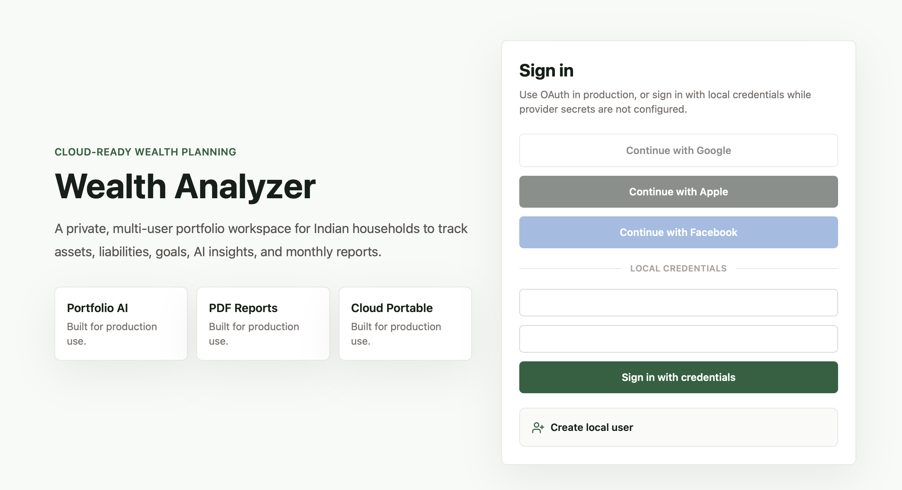

# Wealth Analyzer

Full-stack personal wealth dashboard for Indian households. Wealth Analyzer brings assets, liabilities, monthly commitments, goals, reports, external data feeds, and AI-assisted portfolio review into one private workspace.



## Why This Exists

Most Indian investors do not have one clean view of their real financial position. Mutual funds may sit in CAS/CAMS/KFintech statements, stocks in Zerodha, retirement money in EPF/NPS, insurance in LIC, cash in bank accounts, gold and property in manual records, and liabilities in loan statements.

Wealth Analyzer is built to model that Indian household reality. It is not just a stock tracker. It is a family balance sheet, monthly commitment tracker, reporting console, and advisor context engine.

## What It Can Do Today

- Track a household balance sheet across mutual funds, stocks, ETFs, NPS, EPF, PPF, LIC, ULIP, gold, SGB, savings, fixed deposits, recurring deposits, real estate/plots, vehicles, bonds, PMS/AIF placeholders, crypto, and other assets.
- Track liabilities such as home loans, vehicle loans, personal loans, credit cards, and other debt.
- Show net worth, total assets, liabilities, asset allocation, liquidity, risk indicators, gainers/laggards, and goal progress.
- Break down monthly commitments across mutual fund SIPs, LIC premiums, home loan EMIs, and other recurring investments.
- Create monthly snapshots and trend charts for net worth over time.
- Manage India-specific goals such as retirement corpus, loan closure, education, and long-term net-worth targets.
- Import generic CSV data with duplicate detection.
- Import Zerodha holdings CSVs into stock/ETF assets and advisor context.
- Import CAS/CAMS/KFintech/MFCentral-style mutual fund CSVs into MF assets and advisor context.
- Use a Data Console to view connector status, sync history, manual market intel, and normalized facts passed to the AI Advisor.
- Generate educational AI portfolio insights covering allocation, debt, SIPs, liquidity, goals, MF/stock review, risk, stale/missing data, and reasoning.
- Challenge AI insights in an advisor chat; repeated “why?” questions can reuse stored reasoning before making another AI call.
- Generate investor-style monthly reports and download them as PDFs.
- Export user data and delete local user data from Settings.
- Sign in with local credentials, create local users, or configure Google, Apple, and Facebook OAuth.
- Run locally, in Docker, or on AWS, Azure, and GCP with managed PostgreSQL.

## India Context

The app is designed around Indian portfolio workflows:

- Mutual fund data can start with CAS exports from CAMS, KFintech, or MFCentral.
- Stocks and ETFs can start with Zerodha holdings CSVs, with Kite Connect as a future production path.
- NSE market context is modeled as a licensed/permitted feed. The app does not scrape NSE pages.
- LIC, EPFO, NPS, land, and Account Aggregator are modeled as connectors, with safe manual/upload-first workflows.
- Land valuation is treated separately from Income Tax AIS. AIS can show historical transaction context, but it is not a live land-price source.
- AI output is decision support only and includes an educational disclaimer. It is not SEBI-registered investment advice.

## Product Modules

### Dashboard

The dashboard gives a quick household view:

- Net worth and total asset/liability cards
- Monthly SIP/contribution breakdown
- Net worth trend chart
- Asset allocation chart
- Goal progress
- Debt-to-asset ratio
- Liquid and illiquid wealth view
- Asset class table

### Assets And Liabilities

Manual entry supports a broad Indian asset map:

- Stocks, ETFs, mutual funds, EPF, NPS, PPF
- Gold, SGB, digital gold, gold ETFs
- LIC, ULIP, pension products
- Savings, fixed deposits, recurring deposits
- Bonds, PMS, AIF, ESOP, RSU
- Physical plot, real estate, vehicles, commodities, crypto, other

### Data Console

The Data Console is where external feeds become AI-ready context:

- Zerodha
- CAS / CAMS / KFintech / MFCentral
- NSE market context
- LIC
- EPFO
- NPS
- Land / real estate
- Account Aggregator

Each advisor context fact includes source, as-of date, confidence, staleness, and user ownership metadata. Manual trusted market intel can be added for NSE/BSE, SEBI, RBI, AMFI, broker/vendor, or news context without scraping.

### AI Advisor

The AI Advisor supports OpenAI, Gemini, or Claude. Provider keys can be configured from the authenticated Settings screen, where they are encrypted before being stored in PostgreSQL. Environment variables still work as a cloud-secret fallback when no GUI key is active.

Recommended first setup:

1. Create a Gemini API key in [Google AI Studio](https://aistudio.google.com/app/apikey).
2. In Settings, choose Gemini 2.5 Flash-Lite for the cheapest demo/development path, or Gemini 2.5 Flash for stronger reasoning.
3. Save the key, open Advisor, and run Analyze portfolio.

The advisor reviews the sanitized portfolio and produces educational recommendations with labels such as:

- continue
- review
- watch
- pause and reassess
- rebalance candidate
- insufficient data
- discuss with advisor

Each recommendation stores a proposed move, reason, supporting data, tradeoffs, what would change the recommendation, and a plain-English explanation. The default app does not generate direct buy/sell orders or target-price calls.

### Reports

Reports create a monthly investor-style summary covering:

- Net worth
- Allocation
- Liabilities
- Monthly commitments
- Goals
- Risks
- AI commentary
- PDF download

## Tech Stack

- Next.js App Router and TypeScript
- Tailwind CSS
- Prisma ORM
- PostgreSQL
- NextAuth/Auth.js with credentials and optional Google, Apple, Facebook OAuth
- Recharts
- OpenAI API
- React PDF
- Docker

## Quick Start

Install dependencies:

```bash
npm install
```

Copy environment variables:

```bash
cp .env.example .env
```

Set `DATABASE_URL` to a PostgreSQL database, then prepare the database:

```bash
npm run prisma:deploy
npm run db:seed
```

For local prototyping before migrations are adopted:

```bash
npm run db:push
npm run db:seed
```

Start the app:

```bash
npm run dev
```

Open `http://localhost:3000/login`.

Demo credentials:

```text
Email: demo@wealth.local
Password: password123
```

The demo portfolio uses fictional sample data suitable for showing the app to others.

## Optional Personal Seed

For a separate local-only personal account, set this in `.env` before running `npm run db:seed`:

```bash
SEED_PERSONAL_USER="true"
PERSONAL_USER_NAME="Your Name"
PERSONAL_USER_EMAIL="you@example.com"
PERSONAL_USER_PASSWORD="choose-a-password"
```

Keep personal data out of public template deployments.

## Docker

Build and run locally:

```bash
docker build -t wealth-analyzer .
docker run --env-file .env -p 3000:3000 wealth-analyzer
```

For production, use managed PostgreSQL and run migrations before starting the app:

```bash
npm run prisma:deploy
```

See `docs/deployment.md` for AWS App Runner/ECS, Azure Container Apps/App Service, and GCP Cloud Run notes.

## Environment Variables

Important variables:

- `DATABASE_URL`
- `NEXTAUTH_URL`
- `NEXTAUTH_SECRET`
- `APP_BASE_URL`
- `GOOGLE_CLIENT_ID`
- `GOOGLE_CLIENT_SECRET`
- `APPLE_CLIENT_ID`
- `APPLE_CLIENT_SECRET`
- `FACEBOOK_CLIENT_ID`
- `FACEBOOK_CLIENT_SECRET`
- `AI_PROVIDER`
- `OPENAI_API_KEY`
- `OPENAI_MODEL`
- `GEMINI_API_KEY`
- `GEMINI_MODEL`
- `ANTHROPIC_API_KEY`
- `ANTHROPIC_MODEL`

All secrets should be stored in the target cloud's environment or secret manager.

## Sample Imports

Sample files are available in `samples/`:

- `sample-assets.csv`
- `zerodha-holdings-sample.csv`
- `zerodha-holdings-import.csv`
- `cas-mf-import.csv`
- `bank-statement-sample.csv`

Generic CSV imports support columns such as `name`, `invested_amount`, `current_value`, `transaction_date`, `assetClass`, `ownerType`, `platform`, `liquidity`, `taxCategory`, and `notes`.

## Privacy And Security

- Passwords are hashed with bcrypt.
- User-owned data is scoped by `userId`.
- OAuth and credential sessions are handled by NextAuth/Auth.js.
- Secrets are server-side only.
- Broker, bank, LIC, EPFO, and NPS passwords are not requested or stored.
- AI payloads should exclude secrets, credentials, account numbers, and raw statements.
- Reports are generated on demand.
- Export and delete-user-data controls are included.
- Run `npm audit`, `npm run build`, and `npx prisma validate` before deployment.

## Roadmap

- Zerodha Kite Connect OAuth for holdings, positions, and quotes.
- More complete CAS PDF/Excel parsing.
- EPFO passbook import.
- NPS CRA statement import.
- LIC statement import.
- Account Aggregator consent-based data flow.
- Automated licensed market-data provider adapter for NSE/BSE context.
- XIRR, CAGR, tax-lot, and redeemable amount calculations.
- Goal-to-asset mapping.
- Object-storage adapter for generated report artifacts.
- Optional compliance mode for registered advisors.

## Disclaimer

This project is for portfolio tracking, education, and decision support. It is not SEBI-registered investment advice. Do your own due diligence and consult a qualified advisor before making investment decisions.
